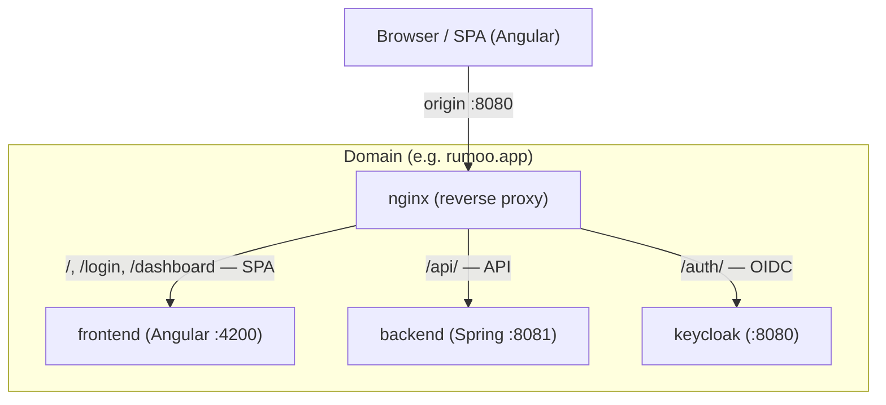
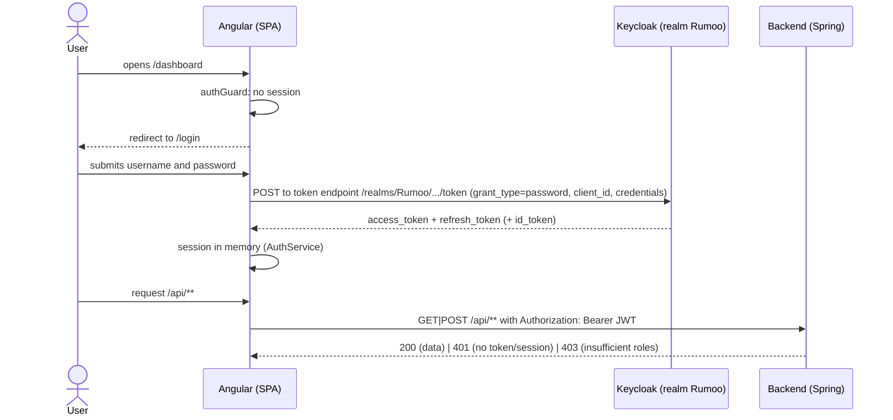
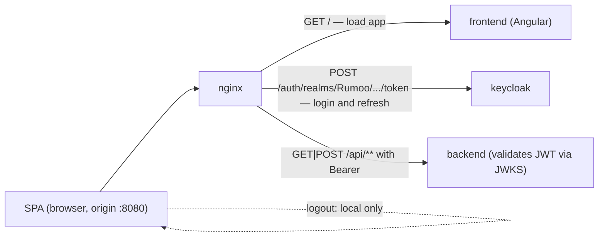
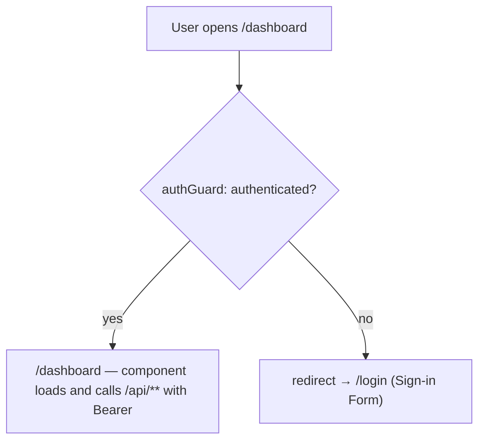
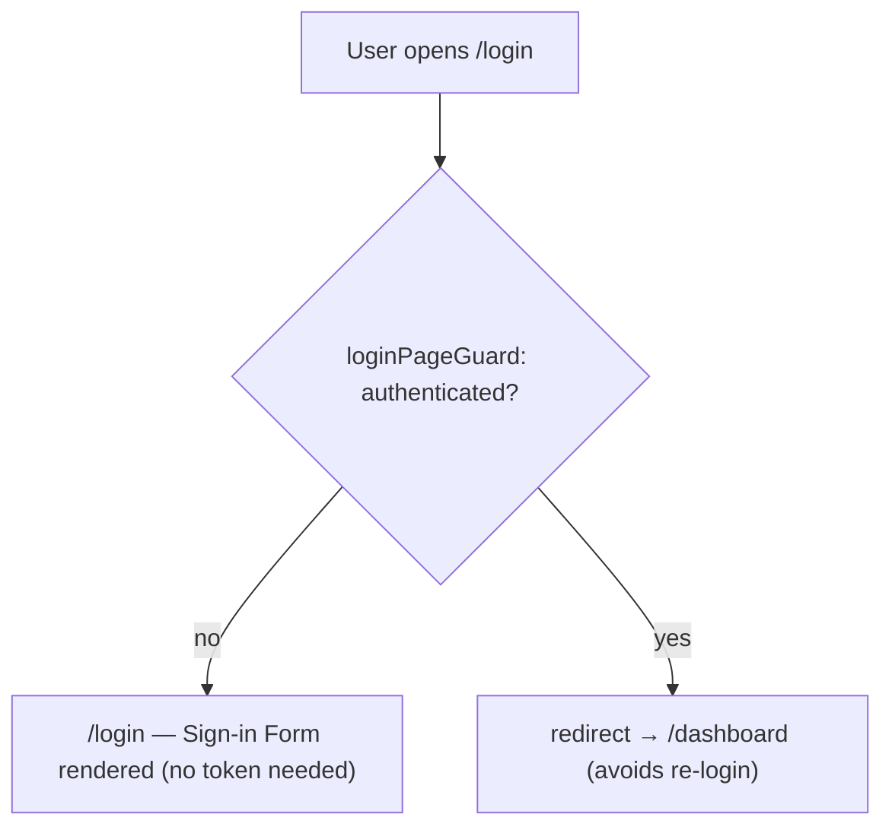
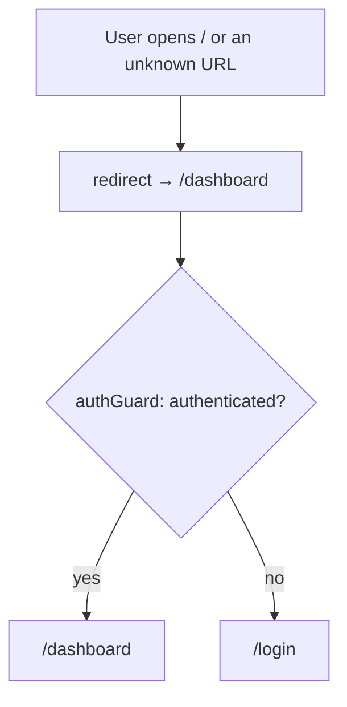
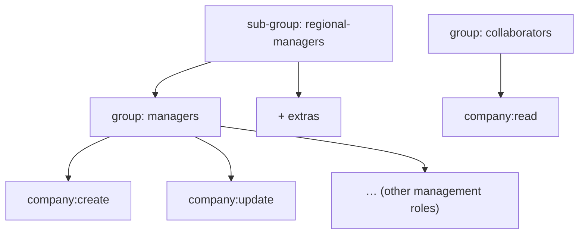

# Authentication and Authorization with Keycloak — Rumoo

> Architecture document. Describes the **topology**, the **flows**, and the **configuration** of
> Rumoo's authentication and authorization using Keycloak. No implementation is covered here;
> this is the reference model the implementation is built from.

---

## 0. What changed in this revision

The frontend authentication stopped using **Authorization Code + PKCE** (a redirect flow with a
Keycloak-hosted login page) and now uses **Resource Owner Password Credentials (ROPC / Direct
Access Grants)**. Timeline:

| Before (removed flow) | After (current flow) |
|-----------------------|----------------------|
| Login redirecting to the Keycloak page (`authorize` + PKCE) | Login on the **SPA-owned page** (**Sign-in Form**), exchanging credentials directly at the token endpoint (`grant_type=password`) |
| `onLoad: check-sso` + `silent-check-sso.html` on startup | No session check on load — a signed-out user goes to `/login` |
| `keycloak-angular` + `keycloak-js` did init/refresh/interceptor | Own `AuthService`: in-memory session, automatic refresh, local `Bearer` interceptor |
| **SSO** logout (OIDC end-session, ends the realm global session) | **Local** logout: clears the in-memory session and returns to `/login` |
| `grant_type=password` disabled on both clients | `rumoo-frontend` with Direct Access Grants enabled; `rumoo-backend` unchanged |
| Redirect URIs and post-logout URIs configured | Redirections are no longer needed |

Removed from the code: `keycloak-angular`, `keycloak-js`, `keycloak.init.ts`,
`public/silent-check-sso.html`, and the Keycloak providers in `app.config.ts`. The **backend did
not change**: it remains a stateless resource server validating the same issuer/JWKS, with
`401`/`403` unchanged.

---

## 1. Overview and decisions

Consolidated decisions:

| # | Decision | Value |
|---|----------|-------|
| D1 | Login flow (frontend) | **Resource Owner Password Credentials** (`grant_type=password`) at the Rumoo Realm token endpoint; **public** client |
| D2 | Login screen ownership | **SPA-owned Sign-in Form**; no Keycloak-hosted page, no redirect, no `check-sso`, no `silent-check-sso.html` |
| D3 | Backend | **Resource Server** with **JWT** validation (stateless, via JWKS) |
| D4 | Deploy topology | Keycloak on **subpath `/auth`** behind nginx (same origin) |
| D5 | Realm | **one single realm** `Rumoo` |
| D6 | Clients | `rumoo-frontend` (**public**, Direct Access Grants) + `rumoo-backend` (**confidential** + service account) |
| D7 | Authorization model | **Roles = granular permissions**; **Groups = organization + role inheritance** |
| D8 | Token content | **realm roles** in the token (via `realm_access.roles`); groups **not** in the token (management only) |
| D9 | Role granularity | **`entity:action`** (e.g. `company:create`) |
| D10 | Logout | **local only** — clears the in-memory session and routes to `/login`; does not end the global (SSO) session |
| D11 | Refresh | automatic by `AuthService` (`grant_type=refresh_token`) before the Access Token expires |
| D12 | Backend session | **none** — backend fully stateless, authorizes by token |

> **Notes:**
> - Leaving the redirect flow and adopting ROPC is a **deliberate, documented decision** — see
>   subsection 1.1. Before this document, the flow was Authorization Code + PKCE.
> - **Q9** (role format) and **Q10** (service account on the backend) are adopted in this
>   document (D9, D6).

### 1.1 Architecture decision: ROPC instead of redirect SSO

Decision record that led to the adoption of ROPC, kept in this document.

**Context:** the business wants a **product-owned** login screen (rendered by the SPA, freely
customizable) with no redirect to the identity provider page. That is not possible with
Authorization Code + PKCE (credential form bound to Keycloak) nor with
`directAccessGrantsEnabled` disabled — the mechanism (grant type) had to change.

**Alternatives considered:**

1. **Custom Keycloak theme** — keep PKCE but restyle the provider's login page.
   *Rejected:* the page stays on Keycloak (limits markup/style to the theme model) and keeps the
   redirect and the SSO coupling.
2. **SPA form driving Keycloak's `login-actions` form** — render the form in the SPA and post it
   to the Keycloak form endpoint. *Rejected:* non-standard, brittle, couples the SPA to the
   provider's HTML; error and session handling opaque.
3. **Resource Owner Password Credentials** — the SPA exchanges username/password directly at the
   token endpoint (`grant_type=password`). *Chosen:* the only standard OIDC mechanism that lets
   the SPA own the form and obtain the token set in one step.

**Accepted consequences (and mitigations):**

- The password travels through **browser JavaScript** to the Rumoo Realm. OAuth BCP discourages
  ROPC for this; it is a deliberate use, with the product-owned screen as the explicit
  requirement.
- **Loss of `check-sso`**: the SPA no longer silently re-establishes a Keycloak session on load.
- **Loss of global (SSO) logout**: no OIDC end-session; logout clears only the SPA's in-memory
  session.
- **Memory-only session**: a page reload returns the user to `/login` (accepted — nothing
  sensitive outlives the page's lifetime).
- **Mitigation:** the backend keeps validating **every** request (signature, issuer, expiry,
  roles) against the same issuer/JWKS; strictly in-memory session; password never persisted or
  logged; token POST is same-origin in the dev stack (nginx), no CORS.

---

## 2. Topology

- `/`, `/login`, `/dashboard` → frontend container (Angular)
- `/api` → backend container (Spring Boot resource server)
- `/auth` → Keycloak container (realm Rumoo)

**Key points:**

- **A single domain/host.** Keycloak is exposed on subpath `/auth` by nginx, together with the
  SPA routes and the API. The SPA, the token endpoint, and the API share the nginx origin, so the
  credential POST (grant) is **same-origin** — no CORS work.
- **Dev:** the dev nginx publishes port 8080 (`deploy/docker-compose.dev.yml`); Keycloak is at
  `http://localhost:8080/auth`.
- **Prod:** self-hosted Keycloak (project convention), also under `/auth`; `KEYCLOAK_URL` derived
  from the domain.

### Environment variables

| Variable | Description | Example | Required |
|----------|-------------|---------|----------|
| `KEYCLOAK_URL` | Public base URL of Keycloak | `http://localhost:8080/auth` | **Yes (prod, no default)** |
| `KEYCLOAK_REALM` | Realm name | `Rumoo` | — |
| `KEYCLOAK_CLIENT_ID` | Frontend public client | `rumoo-frontend` | — |
| `KEYCLOAK_BACKEND_CLIENT_ID` | Backend confidential client | `rumoo-backend` | — |
| `KEYCLOAK_BACKEND_CLIENT_SECRET` | Confidential client secret (never in the frontend) | *(secret)* | **Yes (prod, no default)** |

> The client secret **never** lives in the frontend (a public client has no secret). The
> `rumoo-backend` secret lives only in the backend/deploy, sourced from an env var.
>
> In **production** (`docker-compose.prod.yml`) `KEYCLOAK_URL` and
> `KEYCLOAK_BACKEND_CLIENT_SECRET` have **no default** and must be supplied; the stack fails fast
> at boot if they are missing.

---

## 3. Authentication Flow

### 3.1 Login (Resource Owner Password Credentials)

1. A signed-out user opens `/dashboard`; the `authGuard` finds no session and redirects to
   `/login`.
2. The user submits username and password on the **Sign-in Form** (SPA-owned page — no Keycloak
   page, no navigation).
3. The `AuthService` POSTs `grant_type=password` (+ `client_id` and credentials) to the Rumoo
   Realm token endpoint (`/realms/Rumoo/protocol/openid-connect/token`).
4. On success the token set (Access + Refresh) is held **in memory**; the HTTP interceptor
   attaches `Authorization: Bearer <access_token>` to `/api/**` requests.
5. A successful login always navigates to `/dashboard`. Invalid credentials surface as an inline
   error on the Sign-in Form. An authenticated user opening `/login` is redirected to
   `/dashboard`.

> **Token contract:** the token endpoint returns `{ access_token, refresh_token, id_token,
> expires_in }`. The `AuthService` stores only `access_token` and `refresh_token` and **discards
> the `id_token`** — an OIDC artifact carrying identity claims (`sub`, `preferred_username`,
> `email`) for the client. It is not the API credential and the SPA has no profile-claims need in
> this phase, so it is not kept.

### 3.2 Refresh / expiry

- The `AuthService` derives the Access Token expiry from the `exp` claim and refreshes
  **proactively** before expiry via `grant_type=refresh_token`; a rejected refresh clears the
  session and routes the user back to `/login`.
- A single `401` from the API triggers one refresh-and-retry of the failed request; repeated
  failure ends the session.
- The backend is **stateless**: each request is authorized by the JWT; **no server session and no
  per-request Keycloak call**.

### 3.3 Logout (local)

- Logout clears the in-memory session in the `AuthService` and routes to `/login`.
- **There is no OIDC end-session call**: with the redirect flow removed, Keycloak is not aware of
  the SPA logout (loss of global SSO logout — documented consequence of the ROPC decision).

### 3.4 HTTP request flow (end to end)

Every request leaves the browser to the nginx origin (`http://localhost:8080` in dev), which
routes by path: `/` → frontend, `/api/` → backend, `/auth/` → Keycloak.

- **a) Load the application.** `GET /` → nginx → `frontend` (Angular dev server :4200). The SPA
  loads the initial route and the guard decides: authenticated → `/dashboard`; signed out →
  `/login`.
- **b) Login (credential exchange).** `POST /auth/realms/Rumoo/protocol/openid-connect/token`
  (nginx routes `/auth/` → keycloak), body `application/x-www-form-urlencoded`:
  - `grant_type=password`
  - `client_id=rumoo-frontend`
  - `username` + `password`
  - Responses: `200` → `{ access_token, refresh_token, id_token, expires_in }` — the `AuthService`
    stores `access_token` + `refresh_token` and discards the `id_token` (see section 3.1);
    `400`/`401 invalid_grant` → inline error on the Sign-in Form.
- **c) Authenticated API request.** `GET|POST /api/**` with header
  `Authorization: Bearer <access_token>` (nginx routes `/api/` → backend). The interceptor
  attaches the Bearer only to `/api/**`; other URLs pass through untouched. The backend
  (stateless) validates on every request: signature (JWKS) + issuer + expiry → missing/invalid =
  `401`; valid token with insufficient roles = `403`; ok = `200`. A single `401` triggers one
  forced refresh and one retry; repeated failure ends the session and returns to `/login`.
- **d) Proactive refresh.** `POST /auth/realms/Rumoo/protocol/openid-connect/token` with
  `grant_type=refresh_token`, `client_id=rumoo-frontend`, and `refresh_token`. `200` → renews the
  in-memory token pair; `400 invalid_grant` → local logout and navigation to `/login`.
- **e) Logout.** Client-side only: clears the in-memory session and navigates to `/login`; no
  end-session request is made to Keycloak.

### 3.5 Routes: protected (require authentication) and public (do not)

The Angular router decides the destination of each route through guards that read the
`AuthService` state. Summary:

| Route | Guard | Requires session? | Behavior |
|-------|-------|-------------------|----------|
| `/login` | `loginPageGuard` | No (public) | signed out → Sign-in Form; authenticated → `/dashboard` |
| `/dashboard` | `authGuard` | **Yes** (protected) | signed out → `/login`; authenticated → component |
| `/` and `**` (catch-all) | redirect → `/dashboard` (which applies `authGuard`) | — | resolves to `/dashboard` or `/login` depending on the session |
| `/api/**` (SPA calls) | interceptor + backend | **Yes** (Bearer) | no token/expired → `401`; insufficient roles → `403` |
| `/auth/**` (token endpoint) | — | No (credential exchange) | reachable through the same nginx origin |

**Example — protected route (`/dashboard` requires authentication):**

**Example — public route (`/login` does not require authentication):**

**Root / catch-all route:**

> Rule of thumb: **nothing protected is rendered without a session** — the guard blocks the route
> before the component, and the backend rejects (`401`) any `/api/**` call without a valid token.

---

## 4. Keycloak Configuration

### 4.1 Realm

| Item | Value |
|------|-------|
| Realm name | `Rumoo` |
| Ingress | Realm tokens / access tokens |

A single realm serves the entire application. A new `KEYCLOAK_CLIENT_ID` does not require a new realm.

### 4.2 Clients

#### 4.2.1 `rumoo-frontend` (public)

For the Angular SPA.

| Property | Value |
|----------|-------|
| Client type | **Public** (no secret) |
| Standard flow (Authorization Code) | ❌ disabled |
| Implicit flow | ❌ disabled |
| **Direct Access Grants** | ✅ **enabled** (allows `grant_type=password`) |
| Redirect URIs | not required (no redirect flow) |
| Web Origins | same hosts as the SPA origin (same-origin in the dev stack) |
| Client Scopes | `rumoo-scopes` (roles) + defaults |

> **Public client =** no secret. Its only credential-exchange mechanism is Resource Owner
> Password Credentials, exercised by the SPA from its own Sign-in Form. Credentials travel
> through browser JavaScript — the known, documented ROPC trade-off — and therefore the session
> is kept strictly in memory.

#### 4.2.2 `rumoo-backend` (confidential)

For Spring Boot (resource server + future m2m operations).

| Property | Value |
|----------|-------|
| Client type | **Confidential** |
| Standard flow | ❌ (does not log users in) |
| Service account roles | ✅ enabled (for future m2m/admin calls to Keycloak) |
| Client authentication | Client ID + Secret (env var) |
| Client Scopes | `rumoo-scopes` (roles) + defaults |

**Role:** validate JWTs (via JWKS) and, when needed, m2m operations (client-credentials grant) —
e.g., querying realm users/admin.

### 4.3 Client Scope `rumoo-scopes`

A single Client Scope attached to **both** clients for consistent claims:

| Mapper | Type | Claim |
|--------|------|-------|
| Realm roles | Realm roles | `realm_access.roles` (default) |

> Per **D8**, only **roles** go in the token; **groups** are not exposed as a claim (used only
> for management/role inheritance).

---

## 5. Roles and Groups (authorization model)

### 5.1 Role of each

- **Role** = atomic permission per action. This is what the **backend authorizes**.
- **Group** = grouping of users with **hierarchical role inheritance**, for
  management/organization.

Putting a user in a group grants **all inherited roles** — the backend authorizes only by the
**resulting roles** in the token.

### 5.2 Role catalog (`entity:action`)

Granular per-action roles, realm-scoped. Base for the current domain and roadmap:

| Entity     | Roles |
|------------|-------|
| `company`  | `company:create`, `company:read`, `company:update`, `company:delete` |
| `goal`     | `goal:create`, `goal:read`, `goal:update`, `goal:delete` *(future)* |
| `activity` | `activity:create`, `activity:read`, `activity:update`, `activity:delete`, `activity:assign` *(future)* |

**Mapping to current code (reference):**
- `CreateCompanyUseCase` → `company:create`
- `FindCompanyByIdUseCase` → `company:read`
- `ListCompaniesUseCase` → `company:read`
- `UpdateCompanyUseCase` → `company:update`
- `DeleteCompanyUseCase` → `company:delete`

### 5.3 Suggested groups (organization)

| Group | Inherited roles | Use |
|-------|-----------------|-----|
| `managers` | `company:create`, `company:update`, `company:delete` | Managers |
| `collaborators` | `company:read` | Collaborators (read-only) |
| `regional-managers` (sub of `managers`) | inherits from `managers` | Future regional delegation |

> Tune the group tree as Rumoo's real organizational roles materialize (to define with the
> product).

---

## 6. Backend: JWT Resource Server

- Dependency: `spring-boot-starter-oauth2-resource-server`.
- Issuer config = `KEYCLOAK_URL/realms/Rumoo`; JWKS for signature validation.
- Maps `realm_access.roles` → `GrantedAuthority` (`company:create`, etc.).
- Per-endpoint authorization by the role in the token (e.g.,
  `@PreAuthorize("hasAuthority('company:create')")`).
- **Stateless**: no session, no per-request Keycloak call.
- The `rumoo-backend` service account is available for future m2m operations.

> Implementation details (filters/security config, annotations) belong to the implementation
> phase; this document defines the model.

---

## 7. Security — Zero Trust

- **Everything.** All layers (frontend, backend, Keycloak) require authentication.
- The **public client** carries no secret; its only grant is Resource Owner Password Credentials,
  exercised from the SPA.
- The **backend does not trust the frontend** — it validates the JWT and its roles on every
  request (least privilege); `401` for unauthenticated requests, `403` for insufficient roles.
- Confidential client secret only in the backend, via env var, **fail-fast** when absent.
- **Credentials travel through browser JavaScript** to the Rumoo Realm token endpoint — the known
  ROPC trade-off. Mitigations in force: strictly in-memory session, password never persisted or
  logged, and the backend independently validating every request.
- No session data on the client: a page reload returns the user to `/login`.
- Use TLS in production (HTTPS) for the token exchange and API traffic.

---

## 8. Open questions / pending decisions

- Definitive **Groups** tree per product roles.
- Define the real **prod domain** and draw the prod `nginx.conf` (route `/auth`).
- Decide whether the backend needs **m2m** operations via service account in the first delivery.
- If per-instance/resource permission is ever needed (e.g., edit only Company X), evaluate
  **Keycloak Authorization Services** — **out of scope** in this phase.

---

## 9. Glossary

| Term | Meaning |
|------|---------|
| **Realm** | Identity/security domain grouping clients, users, roles, and groups. |
| **Client** | Application (SPA or backend) requesting authentication/authorization to Keycloak. |
| **Public client** | Client without a secret (SPA). Uses Direct Access Grants. |
| **Confidential client** | Client with a secret (backend). May have a service account. |
| **Sign-in Form** | The SPA-owned credential page (username, password, submit, inline error) that exchanges Resource Owner Password Credentials with the Rumoo Realm. |
| **Resource Owner Password Credentials (ROPC)** | The `grant_type=password` exchange in which the SPA presents username and password directly at the token endpoint. |
| **Access Token** | The JWT carrying the expanded Roles in `realm_access.roles`; the credential the API authorizes with. |
| **Refresh Token** | The credential used to renew the Access Token without re-entering the password. |
| **Session** | The authenticated state held in memory by the `AuthService`, valid only for the page's lifetime. |
| **Role** | Atomic permission per action that the backend authorizes. |
| **Group** | User grouping with hierarchical role inheritance (organization). |
| **Scope** | Unit of claims/permissions attachable to clients (e.g., `rumoo-scopes`). |
| **Claim** | Field inside the JWT. |
| **JWKS** | Public key set of the issuer for validating JWT signatures. |