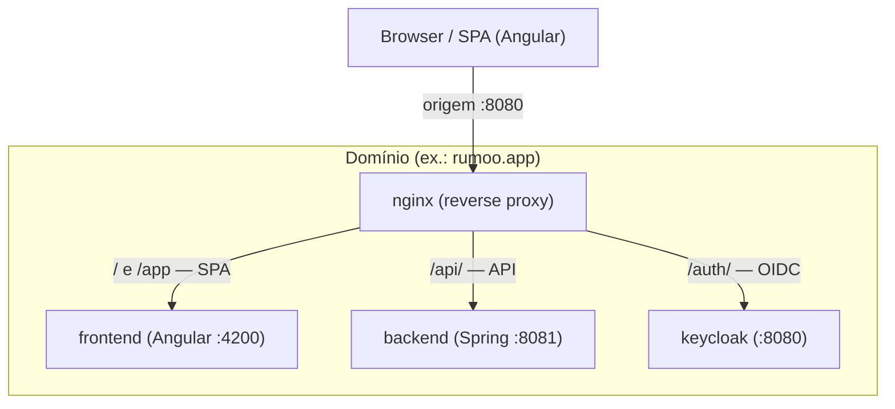
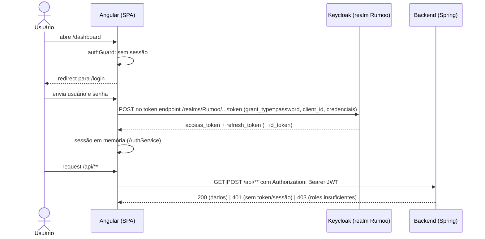
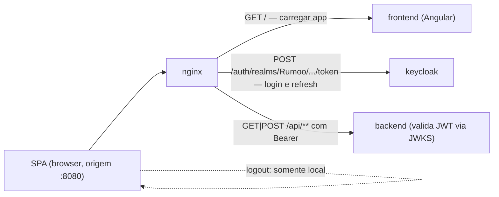
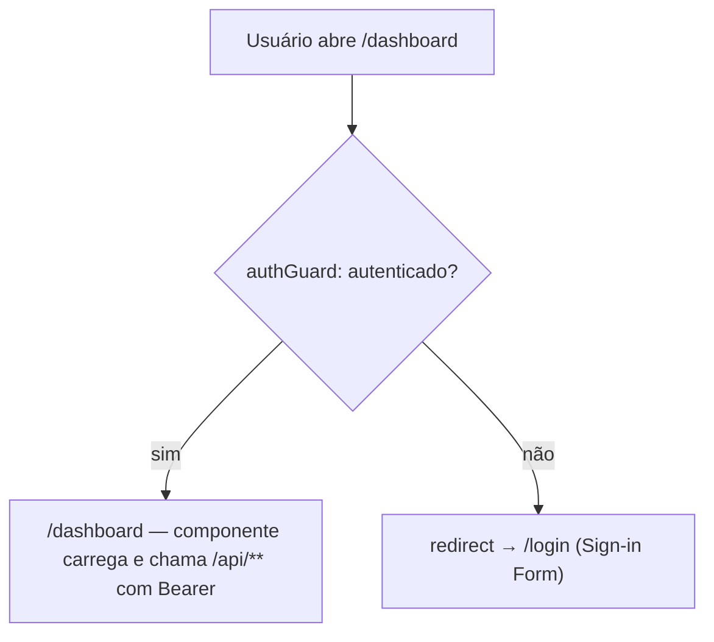
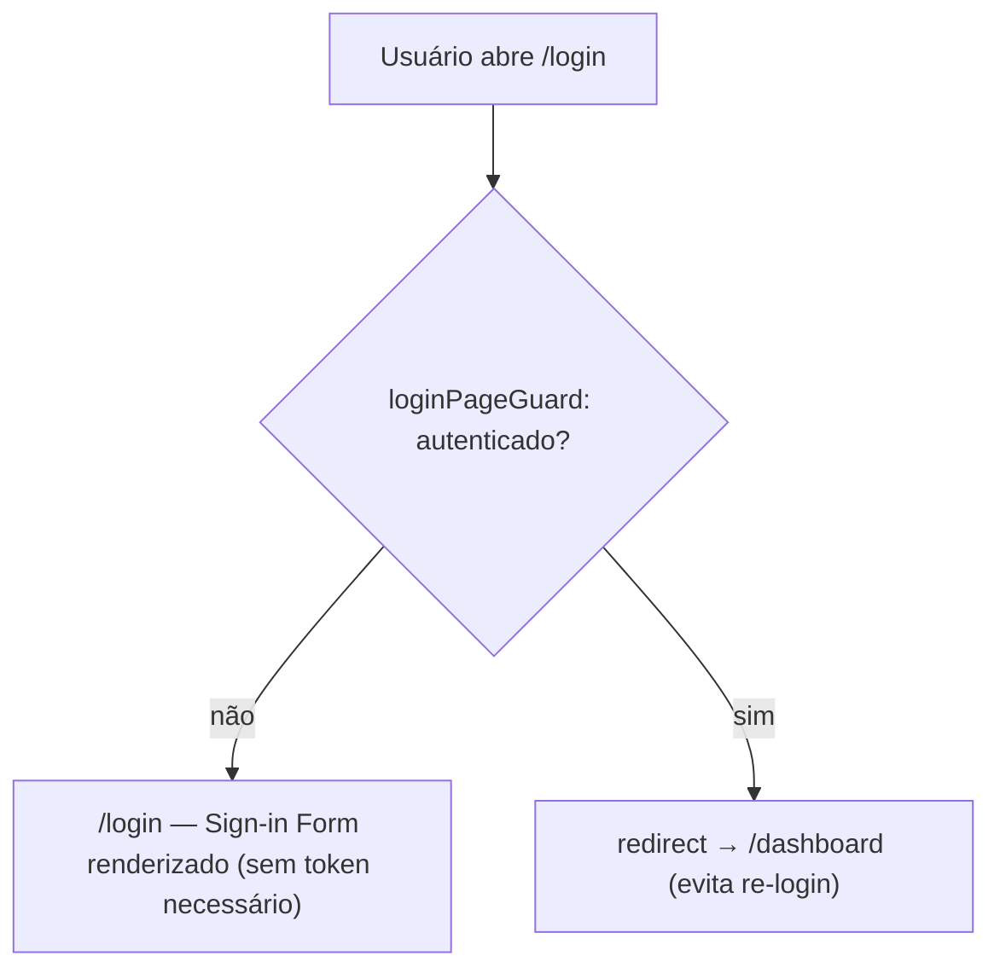
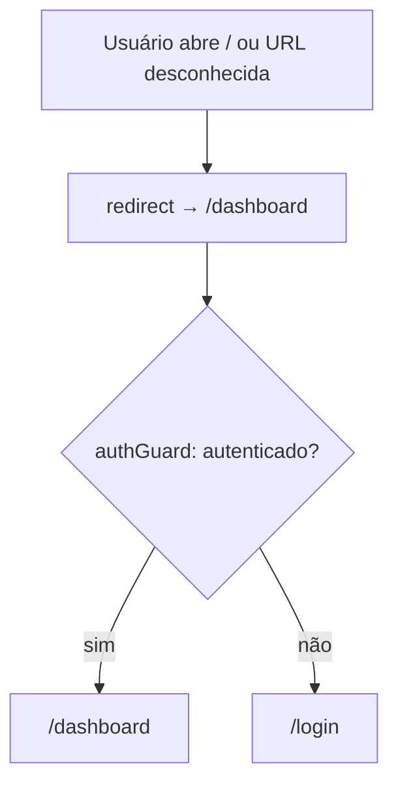
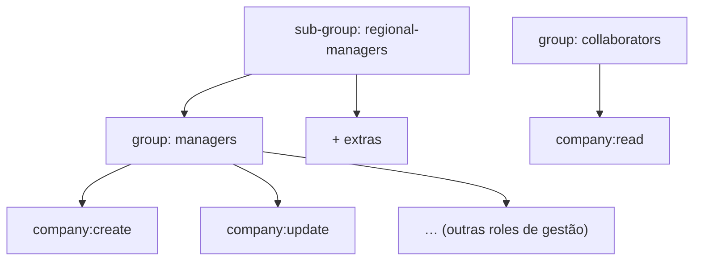

# Autenticação e Autorização com Keycloak — Rumoo

> Documento de arquitetura. Descreve a **topologia**, os **fluxos** e a **configuração** de
> autenticação e autorização do Rumoo usando Keycloak. Nenhuma implementação é coberta aqui;
> este é o modelo de referência a partir do qual a implementação foi feita.

---

## 0. O que mudou nesta revisão

A autenticação do frontend deixou de usar o **Authorization Code + PKCE** (fluxo de redirect com
tela de login hospedada no Keycloak) e passou a usar **Resource Owner Password Credentials
(ROPC / Direct Access Grants)**. A linha do tempo:

| Antes (fluxo removido) | Depois (fluxo atual) |
|------------------------|----------------------|
| Login com redirect para a página do Keycloak (`authorize` + PKCE) | Login na **tela própria da SPA** (**Sign-in Form**), trocando credenciais direto no token endpoint (`grant_type=password`) |
| `onLoad: check-sso` + `silent-check-sso.html` na inicialização | Sem verificação de sessão ao carregar — usuário deslogado vai para `/login` |
| `keycloak-angular` + `keycloak-js` faziam init/refresh/interceptor | `AuthService` próprio: sessão em memória, refresh automático, interceptor local de `Bearer` |
| Logout **SSO** (end-session OIDC, encerra sessão global do realm) | Logout **local**: limpa a sessão em memória e volta para `/login` |
| `grant_type=password` desabilitado nos dois clients | `rumoo-frontend` com Direct Access Grants habilitado; `rumoo-backend` inalterado |
| Redirect URIs e post-logout URIs configurados | Redirecionamentos não são mais necessários |

Removidos do código: `keycloak-angular`, `keycloak-js`, `keycloak.init.ts`,
`public/silent-check-sso.html` e os providers de Keycloak em `app.config.ts`. O **backend não
mudou**: continua um resource server stateless validando o mesmo issuer/JWKS, com `401`/`403`
inalterados.

---

## 1. Visão geral e decisões

Decisões fundamentais consolidadas:

| # | Decisão | Valor |
|---|---------|-------|
| D1 | Fluxo de login (frontend) | **Resource Owner Password Credentials** (`grant_type=password`) no token endpoint do Rumoo Realm; client **public** |
| D2 | Posse da tela de login | **Sign-in Form** da SPA; sem página hospedada no Keycloak, sem redirect, sem `check-sso`, sem `silent-check-sso.html` |
| D3 | Backend | **Resource Server** com validação **JWT** (stateless, via JWKS) |
| D4 | Topologia de deploy | Keycloak em **subpath `/auth`** atrás do nginx (mesma origem) |
| D5 | Realm | **um único realm** `Rumoo` |
| D6 | Clients | `rumoo-frontend` (**public**, Direct Access Grants) + `rumoo-backend` (**confidential** + service account) |
| D7 | Modelo de autorização | **Roles = permissões granulares**; **Groups = organização + herança de roles** |
| D8 | Conteúdo do token | **realm roles** no token (via `realm_access.roles`); groups **não** vão no token (só gestão) |
| D9 | Granularidade das roles | **`entidade:acao`** (ex.: `company:create`) |
| D10 | Logout | **somente local** — limpa a sessão em memória e roteia para `/login`; não encerra sessão global (SSO) |
| D11 | Refresh | automático pelo `AuthService` (`grant_type=refresh_token`) antes da expiração do Access Token |
| D12 | Sessão no backend | **nenhuma** — backend 100% stateless, autoriza pelo token |

> **Notas:**
> - A saída do redirect flow e a adoção de ROPC são uma **decisão deliberada e documentada** —
>   ver subseção 1.1. Antes deste documento, o fluxo era Authorization Code + PKCE.
> - **Q9** (formato de roles) e **Q10** (service account no backend) foram adotados neste
>   documento (D9, D6).

### 1.1 Decisão de arquitetura: ROPC em vez de redirect SSO

Registro da decisão que levou à adoção do ROPC, mantido neste documento.

**Contexto:** o negócio quer uma tela de login **própria** (renderizada pela SPA, customizável
pelo produto), sem redirect para a página do identity provider. Isso não é possível com
Authorization Code + PKCE (formulário preso ao Keycloak) nem com `directAccessGrantsEnabled`
desabilitado — era preciso trocar o mecanismo (grant type).

**Alternativas consideradas:**

1. **Tema personalizado no Keycloak** — manter PKCE mas estilizar a página de login do provider.
   *Rejeitada:* a página continua no Keycloak (limita markup/estilo ao modelo de tema) e mantém o
   redirect e o acoplamento de SSO.
2. **Formulário SPA dirigindo o `login-actions` do Keycloak** — renderizar o formulário na SPA e
   postar no endpoint de formulário do Keycloak. *Rejeitada:* não padronizada, frágil, acopla a
   SPA ao HTML do provider; erro e sessão opacos.
3. **Resource Owner Password Credentials** — a SPA troca usuário/senha direto no token endpoint
   (`grant_type=password`). *Escolhida:* único mecanismo OIDC padrão que permite à SPA possuir o
   formulário e obter o token em um passo.

**Consequências aceitas (e mitigações):**

- A senha passa pelo **JavaScript do browser** até o Rumoo Realm. O BCP da OAuth desaconselha ROPC
  para isso; é uso deliberado, com a tela própria como requisito explícito.
- **Perda do `check-sso`**: a SPA não reestabelece sessão Keycloak silenciosamente ao carregar.
- **Perda do logout SSO (global)**: sem end-session OIDC; o logout limpa apenas a sessão em memória
  da SPA.
- **Sessão apenas em memória**: reload da página volta para `/login` (aceito — nada sensível
  sobrevive à vida da página).
- **Mitigação:** backend continua validando **todo** request (assinatura, issuer, expiração, roles)
  contra o mesmo issuer/JWKS; sessão estritamente em memória; senha nunca persistida/logada;
  token POST é same-origin no stack de dev (nginx), sem CORS.

---

## 2. Topologia

- `/app` → container frontend (Angular estático)
- `/api` → container backend (Spring Boot resource server)
- `/auth` → container Keycloak (realm Rumoo)

**Pontos-chave:**

- **Um único domínio/host.** O Keycloak é exposto em subpath `/auth` pelo nginx, junto das rotas
  da SPA (`/app`) e da API (`/api`). A SPA, o token endpoint e a API compartilham a origem do
  nginx, então o POST de credenciais (grant) é **same-origin** — sem trabalho de CORS.
- **Dev:** o nginx de dev publica a porta 8080 (`deploy/docker-compose.dev.yml`); o Keycloak fica
  em `http://localhost:8080/auth`.
- **Prod:** Keycloak self-hosted (convenção do projeto), também sob `/auth`; `KEYCLOAK_URL`
  derivado do domínio.

### Variáveis de ambiente

| Variável | Descrição | Exemplo |
|----------|-----------|---------|
| `KEYCLOAK_URL` | Base URL pública do Keycloak | `http://localhost:8080/auth` |
| `KEYCLOAK_REALM` | Nome do realm | `Rumoo` |
| `KEYCLOAK_CLIENT_ID` | Client public do frontend | `rumoo-frontend` |
| `KEYCLOAK_BACKEND_CLIENT_ID` | Client confidential do backend | `rumoo-backend` |
| `KEYCLOAK_BACKEND_CLIENT_SECRET` | Secret do client confidential (nunca no frontend) | *(segredo)* |

> O secret do client **nunca** reside no frontend (client public não tem secret). O secret do
> `rumoo-backend` vive apenas no backend/deploy, vindo de env var.

---

## 3. Fluxo de Autenticação

### 3.1 Login (Resource Owner Password Credentials)

1. Um usuário deslogado abre `/dashboard`; o `authGuard` não encontra sessão e redireciona para
   `/login`.
2. O usuário envia usuário e senha no **Sign-in Form** (tela própria da SPA — sem página do
   Keycloak, sem navegação).
3. O `AuthService` faz POST com `grant_type=password` (+ `client_id` e credenciais) no token
   endpoint do Rumoo Realm (`/realms/Rumoo/protocol/openid-connect/token`).
4. Em sucesso, o conjunto de tokens (Access + Refresh) fica **em memória**; o interceptor HTTP
   anexa `Authorization: Bearer <access_token>` às requisições `/api/**`.
5. Um login bem-sucedido sempre navega para `/dashboard`. Credenciais inválidas geram erro inline
   no Sign-in Form. Um usuário autenticado que abre `/login` é redirecionado para `/dashboard`.

### 3.2 Refresh / expiração

- O `AuthService` deriva a expiração do Access Token do claim `exp` e faz o refresh
  **preventivamente** antes da expiração via `grant_type=refresh_token`; um refresh rejeitado
  limpa a sessão e roteia o usuário de volta para `/login`.
- Um único `401` da API dispara um refresh-e-tentativa da requisição; falha repetida encerra a
  sessão.
- O backend é **stateless**: cada request é autorizado pelo JWT; **não há sessão de servidor nem
  chamada ao Keycloak por request**.

### 3.3 Logout (local)

- O logout limpa a sessão em memória no `AuthService` e roteia para `/login`.
- **Não há chamada de end-session (OIDC)**: com o fluxo de redirect removido, o Keycloak não fica
  sabendo do logout da SPA (perda do logout SSO global — consequência documentada da decisão ROPC).

### 3.4 Fluxo de requisições HTTP (ponta a ponta)

Toda requisição sai do browser para a origem do nginx (`http://localhost:8080` no dev), que
roteia pelo path: `/app`/`/` → frontend, `/api/` → backend, `/auth/` → Keycloak.

- **a) Carregar a aplicação.** `GET /` → nginx → `frontend` (Angular dev server :4200). A SPA
  carrega a rota inicial e o guard decide: autenticado → `/dashboard`; deslogado → `/login`.
- **b) Login (troca de credenciais).** `POST /auth/realms/Rumoo/protocol/openid-connect/token`
  (nginx roteia `/auth/` → keycloak), corpo `application/x-www-form-urlencoded`:
  - `grant_type=password`
  - `client_id=rumoo-frontend`
  - `username` + `password`
  - Respostas: `200` → `{ access_token, refresh_token, id_token, expires_in }` (sessão em memória);
    `400`/`401 invalid_grant` → erro inline no Sign-in Form.
- **c) Requisição autenticada à API.** `GET|POST /api/**` com header
  `Authorization: Bearer <access_token>` (nginx roteia `/api/` → backend). O interceptor anexa o
  Bearer apenas em `/api/**`; as demais URLs passam intactas. O backend (stateless) valida em cada
  request: assinatura (JWKS) + issuer + expiração → ausente/inválido = `401`; token válido com
  roles insuficientes = `403`; ok = `200`. Um único `401` dispara um refresh forçado e um retry;
  falha repetida encerra a sessão e volta para `/login`.
- **d) Refresh preventivo.** `POST /auth/realms/Rumoo/protocol/openid-connect/token` com
  `grant_type=refresh_token`, `client_id=rumoo-frontend` e `refresh_token`. `200` → atualiza o par
  de tokens em memória; `400 invalid_grant` → logout local e navegação para `/login`.
- **e) Logout.** Somente no cliente: limpa a sessão em memória e navega para `/login`; nenhuma
  requisição de end-session é feita ao Keycloak.

### 3.5 Rotas: protegidas (exigem autenticação) e públicas (não exigem)

O roteador do Angular decide o destino de cada rota com base em guards, que consultam o estado do
`AuthService`. Resumo:

| Rota | Guard | Exige sessão? | Comportamento |
|------|-------|---------------|---------------|
| `/login` | `loginPageGuard` | Não (pública) | deslogado → Sign-in Form; autenticado → `/dashboard` |
| `/dashboard` | `authGuard` | **Sim** (protegida) | deslogado → `/login`; autenticado → componente |
| `/` e `**` (catch-all) | redirect → `/dashboard` (que aplica o `authGuard`) | — | resolve para `/dashboard` ou `/login` conforme a sessão |
| `/api/**` (chamadas da SPA) | interceptor + backend | **Sim** (Bearer) | sem token/vencido → `401`; roles insuficientes → `403` |
| `/auth/**` (token endpoint) | — | Não (troca de credenciais) | acessível pela mesma origem do nginx |

**Exemplo — rota protegida (`/dashboard` exige autenticação):**

**Exemplo — rota pública (`/login` não exige autenticação):**

**Rota raiz / catch-all:**

> Regra prática: **nada protegido é renderizado sem sessão** — o guard barra a rota antes do
> componente, e o backend rejeita (`401`) qualquer chamada `/api/**` sem token válido.

---

## 4. Configuração no Keycloak

### 4.1 Realm

| Item | Valor |
|------|-------|
| Realm name | `Rumoo` |
| Ingress | Realm tokens / access tokens |

Um único realm serve toda a aplicação. Um novo `KEYCLOAK_CLIENT_ID` não exige novo realm.

### 4.2 Clients

#### 4.2.1 `rumoo-frontend` (public)

Para o SPA Angular.

| Propriedade | Valor |
|-------------|-------|
| Client type | **Public** (sem secret) |
| Standard flow (Authorization Code) | ❌ desabilitado |
| Implicit flow | ❌ desabilitado |
| **Direct Access Grants** | ✅ **habilitado** (permite `grant_type=password`) |
| Redirect URIs | não necessárias (não há fluxo de redirect) |
| Web Origins | mesmos hosts da origem da SPA (same-origin no stack de dev) |
| Client Scopes | `rumoo-scopes` (roles) + defaults |

> **Client public =** sem secret. Seu único mecanismo de troca de credenciais é o Resource Owner
> Password Credentials, exercido pela SPA a partir do próprio Sign-in Form. As credenciais
> trafegam pelo JavaScript do browser — é o trade-off conhecido e documentado do ROPC — e por isso
> a sessão é mantida estritamente em memória.

#### 4.2.2 `rumoo-backend` (confidential)

Para o Spring Boot (resource server + futuras operações m2m).

| Propriedade | Valor |
|-------------|-------|
| Client type | **Confidential** |
| Standard flow | ❌ (não faz login de usuário) |
| Service account roles | ✅ habilitado (para chamadas m2m/admin futuras ao Keycloak) |
| Client authentication | Client ID + Secret (env var) |
| Client Scopes | `rumoo-scopes` (roles) + defaults |

**Papel:** validar JWTs (via JWKS) e, quando necessário, operações m2m (grant
client-credentials) — ex.: consultar usuários/realm admin.

### 4.3 Client Scope `rumoo-scopes`

Client Scope único anexado aos **dois** clients para garantir claims consistentes:

| Mapper | Tipo | Claim |
|--------|------|-------|
| Realm roles | Realm roles | `realm_access.roles` (default) |

> Conforme **D8**, apenas **roles** vão no token; **groups** não são expostos como claim (usados
> somente para gestão/herança de roles).

---

## 5. Roles e Groups (modelo de autorização)

### 5.1 Papel de cada um

- **Role** = permissão atômica por ação. É o que o **backend autoriza**.
- **Group** = agrupamento de usuários com **herança hierárquica de roles**, para
  gestão/organização.

Colocar um usuário em um group dá a ele **todas as roles herdadas** — o backend autoriza apenas
pelas **roles resultantes** no token.

### 5.2 Catálogo de roles (`entidade:acao`)

Roles granulares por ação, realm-scoped. Base para o domínio atual e roadmap:

| Entidade   | Roles |
|------------|-------|
| `company`  | `company:create`, `company:read`, `company:update`, `company:delete` |
| `goal`     | `goal:create`, `goal:read`, `goal:update`, `goal:delete` *(future)* |
| `activity` | `activity:create`, `activity:read`, `activity:update`, `activity:delete`, `activity:assign` *(future)* |

**Mapeamento com o código atual (referência):**
- `CreateCompanyUseCase` → `company:create`
- `FindCompanyByIdUseCase` → `company:read`
- `ListCompaniesUseCase` → `company:read`
- `UpdateCompanyUseCase` → `company:update`
- `DeleteCompanyUseCase` → `company:delete`

### 5.3 Groups sugeridos (organização)

| Group | Roles herdadas | Uso |
|-------|----------------|-----|
| `managers` | `company:create`, `company:update`, `company:delete` | Gestores |
| `collaborators` | `company:read` | Colaboradores (apenas leitura) |
| `regional-managers` (sub de `managers`) | herda de `managers` | Delegação regional futura |

> Ajustar a árvore de groups conforme os papéis organizacionais reais do Rumoo (a definir com o
> produto).

---

## 6. Backend: Resource Server JWT

- Dependência: `spring-boot-starter-oauth2-resource-server`.
- Configuração do issuer = `KEYCLOAK_URL/realms/Rumoo`; JWKS para validação de assinatura.
- Converte `realm_access.roles` → `GrantedAuthority` (`company:create`, etc.).
- Autorização por endpoint pelo papel no token (ex.: `@PreAuthorize("hasAuthority('company:create')")`).
- **Stateless**: sem sessão, sem chamada ao Keycloak por request.
- Service account do client `rumoo-backend` disponível para operações m2m futuras.

> Detalhes de implementação (filters/security config, anotações) pertencem à fase de
> implementação; este documento define o modelo.

---

## 7. Segurança — Zero Trust

- **Tudo.** Todas as camadas (frontend, backend, Keycloak) exigem autenticação.
- O **client public** não carrega segredo; seu único grant é o Resource Owner Password
  Credentials, exercido a partir da SPA.
- O **backend não confia no frontend** — valida o JWT e suas roles a cada request (menor
  privilégio); `401` para requisições não autenticadas, `403` para roles insuficientes.
- Secret do client confidential somente no backend, via env var, **fail-fast** se ausente.
- **As credenciais trafegam pelo JavaScript do browser** até o token endpoint do Rumoo Realm — o
  trade-off conhecido do ROPC. Mitigações em vigor: sessão estritamente em memória, senha nunca
  persistida/logada, e o backend validando independentemente cada request.
- Sem dados de sessão no cliente: um reload da página devolve o usuário para `/login`.
- Usar TLS em produção (HTTPS) para a troca de tokens e o tráfego da API.

---

## 8. Pendências / decisões em aberto

- Árvore definitiva de **Groups** conforme os papéis do produto.
- Definir **domínio real** de prod e desenhar o `nginx.conf` de prod (rota `/auth`).
- Decidir se o backend precisará de operações **m2m** via service account já na 1ª entrega.
- Se surgir necessidade de permissão **por instância/recurso** (ex.: editar só a Empresa X),
  avaliar **Keycloak Authorization Services** — **fora de escopo** nesta fase.

---

## 9. Glossário

| Termo | Significado |
|-------|-------------|
| **Realm** | Domínio de identidade/segurança que agrupa clients, users, roles e groups. |
| **Client** | Aplicação (SPA ou backend) que solicita autenticação/autorização ao Keycloak. |
| **Client public** | Client sem segredo (SPA). Usa Direct Access Grants. |
| **Client confidential** | Client com secret (backend). Pode ter service account. |
| **Sign-in Form** | A tela de credenciais de posse da SPA (usuário, senha, submit, erro inline) que troca Resource Owner Password Credentials com o Rumoo Realm. |
| **Resource Owner Password Credentials (ROPC)** | A troca `grant_type=password` na qual a SPA apresenta usuário e senha diretamente no token endpoint. |
| **Role** | Permissão atômica por ação que o backend autoriza. |
| **Group** | Agrupamento de usuários com herança hierárquica de roles (organização). |
| **Scope** | Unidade de claims/permsks associável a clients (ex.: `rumoo-scopes`). |
| **Claim** | Campo dentro do token JWT. |
| **JWKS** | Conjunto de chaves públicas do issuer para validar assinatura JWT. |