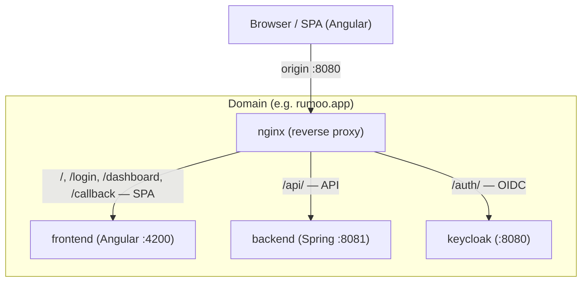
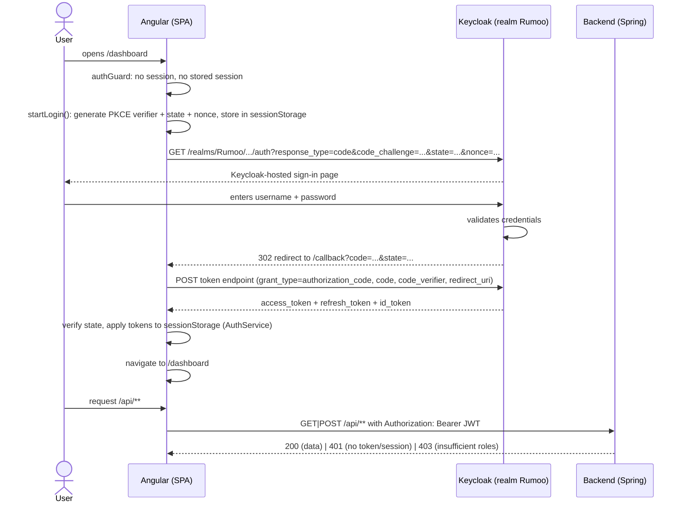
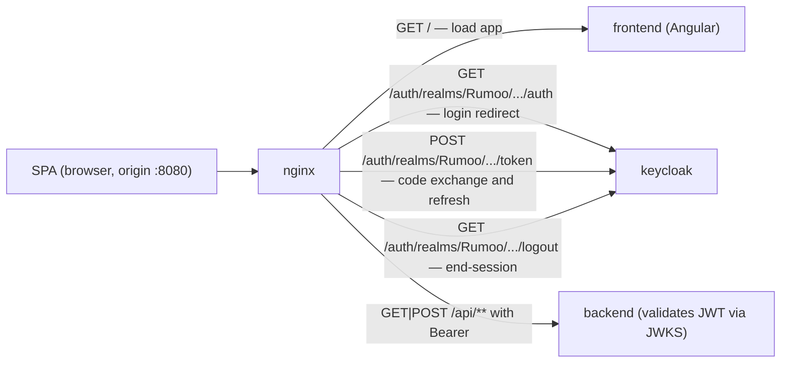
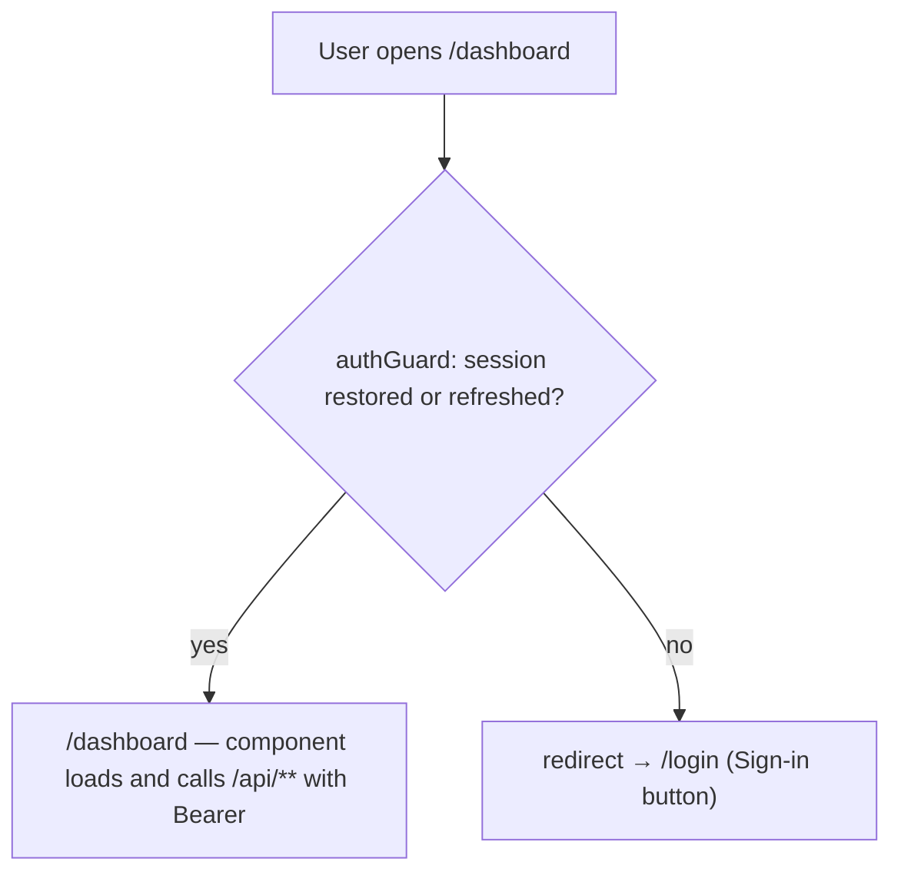
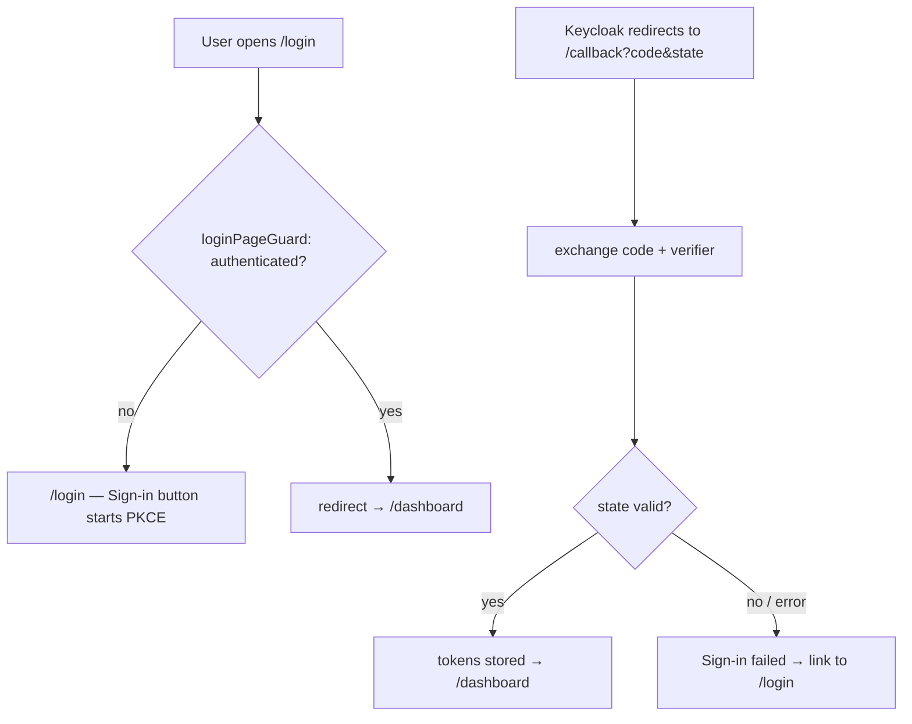
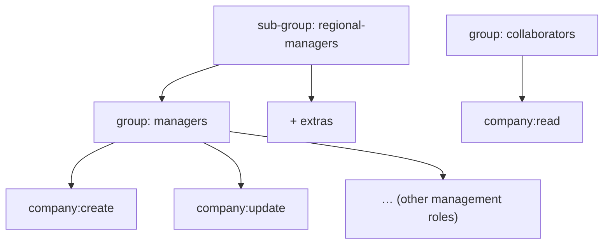

# Authentication and Authorization with Keycloak — Rumoo

> Architecture document. Describes the **topology**, the **flows**, and the **configuration** of
> Rumoo's authentication and authorization using Keycloak. No implementation is covered here;
> this is the reference model the implementation is built from.

---

## 0. What changed in this revision

The frontend authentication returned to **Authorization Code + PKCE** (a redirect flow with a
Keycloak-hosted login page) after a period using **Resource Owner Password Credentials (ROPC /
Direct Access Grants)**. ROPC is gone. Timeline:

| Before (removed flow) | After (current flow) |
|-----------------------|----------------------|
| Login on the **SPA-owned page** (**Sign-in Form**), exchanging credentials at the token endpoint (`grant_type=password`) | Login redirecting to the **Keycloak-hosted page** (`authorize` + PKCE) |
| No session check on load — a signed-out user goes to `/login` | **Session restore on load**: the SPA hydrates the session from `sessionStorage` and proactively refreshes |
| In-memory session lost on reload | Session **persists across reloads** in `sessionStorage` |
| **Local** logout (clears in-memory session; Keycloak unaware) | **OIDC end-session** logout with `id_token_hint` — ends the realm global session, then returns to `/login` |
| Direct Access Grants enabled on `rumoo-frontend` | `rumoo-frontend` with **Standard Flow only**; Direct Access Grants **disabled** |
| Redirections not required | **Redirect URIs** and **post-logout URIs** configured (exact `/callback` + `/login` origin) |
| Refresh without replay protection | **Refresh Token Rotation with replay detection** (realm-level, `revokeRefreshToken` + `refreshTokenMaxReuse`) |

The rationale for returning to the redirect flow is recorded in `docs/adr/0002-authorization-code-pkce.md`.
The backend is untouched: it remains a stateless resource server validating the same
issuer/JWKS, with `401`/`403` unchanged.

---

## 1. Overview and decisions

Consolidated decisions:

| # | Decision | Value |
|---|----------|-------|
| D1 | Login flow (frontend) | **Authorization Code + PKCE** (`response_type=code`, **S256**) at the Rumoo Realm; redirect to the **Keycloak-hosted login page**; **public** client |
| D2 | Login page ownership | **Keycloak-hosted** sign-in; the SPA initiates via `startLogin()` and continues its session at the **`/callback`** route |
| D3 | Backend | **Resource Server** with **JWT** validation (stateless, via JWKS) |
| D4 | Deploy topology | Keycloak on **subpath `/auth`** behind nginx (same origin) |
| D5 | Realm | **one single realm** `Rumoo` |
| D6 | Clients | `rumoo-frontend` (**public**, **Standard Flow**, no Direct Access Grants) + `rumoo-backend` (**confidential**, **no service account**) |
| D7 | Authorization model | **Roles = granular permissions**; **Groups = organization + role inheritance** |
| D8 | Token content | **realm roles** in the token (via `realm_access.roles`); groups **not** in the token (management only) |
| D9 | Role granularity | **`entity:action`** (e.g. `company:create`) |
| D10 | Logout | **OIDC end-session** (`id_token_hint` + `client_id` + `post_logout_redirect_uri`) — ends the realm global session, then `/login` |
| D11 | Refresh | automatic by `AuthService` (`grant_type=refresh_token`, **single-flight**) before the Access Token expires |
| D12 | Session persistence | **`sessionStorage`**, tab-scoped; restored on load (reload-safe, fresh login per tab) |
| D13 | PKCE | S256 challenge derived from a random **code_verifier**; **state** (CSRF) and **nonce** (id_token binding) held in `sessionStorage` during the flow |
| D14 | Refresh token lifecycle | **Rotation + replay detection** (`revokeRefreshToken=true`, `refreshTokenMaxReuse=0`); refresh token lifetime follows Keycloak defaults (the 26.7 realm model exports no `refreshTokenLifespan`) |

### 1.1 Decisions removed with ROPC (do not resurrect)

The following were decisions of the ROPC era and are **reverted** — see the ADR:

- **SPA-owned credential form / Sign-in Form**: gone. The Keycloak-hosted page owns credentials;
  the SPA never sees or transports the password.
- **Direct Access Grants on `rumoo-frontend`**: disabled. The frontend client performs
  **no** `grant_type=password` exchange.
- **Local-only logout**: gone. Logout performs the OIDC end-session request.
- **Memory-only session**: gone. The session lives in `sessionStorage` and is restored on reload.
- **`rumoo-backend` service account**: disabled until a concrete m2m need exists (least privilege).

---

## 2. Topology

- `/`, `/login`, `/callback`, `/dashboard` → frontend container (Angular)
- `/api/**` → backend container (Spring Boot resource server)
- `/auth/**` → Keycloak container (realm Rumoo)

**Key points:**

- **A single domain/host.** Keycloak is exposed on subpath `/auth` by nginx, together with the
  SPA routes and the API. The authorize/token/end-session requests and the API share the nginx
  origin — no CORS work, and the `/callback` route collides with nothing (`/auth/…` is reserved
  for Keycloak).
- **Dev:** the dev nginx publishes port 8080 (`deploy/docker-compose.dev.yml`); Keycloak is at
  `http://localhost:8080/auth`; the callback is `http://localhost:8080/callback`.
- **Prod:** self-hosted Keycloak (project convention), also under `/auth`; `KEYCLOAK_URL` derived
  from the domain.

### Environment variables

| Variable | Description | Example | Required |
|----------|-------------|---------|----------|
| `KEYCLOAK_URL` | Public base URL of Keycloak | `http://localhost:8080/auth` | **Yes (prod, no default)** |
| `KEYCLOAK_REALM` | Realm name | `Rumoo` | — |
| `KEYCLOAK_CLIENT_ID` | Frontend public client | `rumoo-frontend` | — |
| `KEYCLOAK_BACKEND_CLIENT_ID` | Backend confidential client | `rumoo-backend` | — |
| `KEYCLOAK_BACKEND_CLIENT_SECRET` | Confidential client secret (never in the frontend) | *(secret)* | **Yes (prod, no default)** |

> The frontend client is **public** (no secret at all); the `rumoo-backend` secret lives only in
> the backend/deploy, sourced from an env var that is **fail-fast** at boot when missing in
> production.
>
> The **redirect URI is derived at runtime** from `window.location.origin` + `/callback` — no
> additional environment variable, and the configured value on the Keycloak client must match
> exactly (e.g. `http://localhost:8080/callback` in dev).

---

## 3. Authentication Flow

### 3.1 Login (Authorization Code + PKCE)

1. A signed-out user opens `/dashboard`; the `authGuard` finds no session and no stored session
   and redirects to `/login`.
2. The user clicks **Sign in**; the `AuthService` generates the **PKCE pair** (random
   `code_verifier`, its **S256 code_challenge**), a **state**, and a **nonce**, stores them in
   `sessionStorage`, and redirects to the **Keycloak authorize endpoint**.
3. Keycloak renders its **hosted login page**; on success it redirects the browser back to
   `/callback?code=…&state=…` (exact redirect URI).
4. The callback route validates the returned **state** against the stored one (CSRF), then
   exchanges the **code** + **code_verifier** at the token endpoint (`grant_type=authorization_code`).
5. On success the token set (access + refresh + id) is held in `sessionStorage` (tab-scoped) and
   the app navigates to `/dashboard`. An authenticated user opening `/login` is redirected to
   `/dashboard`.
6. From then on, the interceptor attaches `Authorization: Bearer <access_token>` to `/api/**`
   requests.

> **Token contract:** the token endpoint returns `{ access_token, refresh_token, id_token,
> expires_in }`. The `AuthService` keeps all three in `sessionStorage`: `access_token` is the API
> credential, `refresh_token` powers rotation, and `id_token` is kept for the **end-session logout**
> (used as `id_token_hint`).

### 3.2 PKCE material lifecycle

| Artifact | Purpose | Held where | Consumed when |
|----------|---------|-----------|---------------|
| **code_verifier** (random, 64 base64url chars) | Proves the browser that started the flow finishes it | `sessionStorage` (`rumoo.oidc.verifier`) | Sent once in the token exchange, then removed |
| **code_challenge** (S256 of the verifier) | Sent at authorize time so the code can be bound | authorize request | — |
| **state** | CSRF protection — ties the callback to this flow | `sessionStorage` (`rumoo.oidc.state`) | Validated against the callback's `state`, then removed |
| **nonce** | Binds the `id_token` (replay protection) | `sessionStorage` (`rumoo.oidc.nonce`) | Validated inside the `id_token` if present, then removed |

### 3.3 Session restore and refresh

- The session lives in **`sessionStorage`** under the `rumoo.auth.*` keys and survives reloads
  (per-tab). On app startup the `AuthService` **hydrates** from storage and, if the access token is
  within 30 s of expiry, proactively **refreshes**.
- **Refresh** is `grant_type=refresh_token`, **single-flight** (concurrent calls share one in-flight
  request). The realm is configured with **Refresh Token Rotation + replay detection**: every refresh
  mints a new refresh token and the old one is revoked (`refreshTokenMaxReuse=0`).
- A rejected refresh (e.g. revoked/expired) clears the session and returns to `/login`.
- A single `401` from the API triggers one **forced** refresh and one retry of the failed request;
  repeated failure ends the session.

### 3.4 Logout (OIDC end-session)

- Logout clears the local session (**`rumoo.auth.*`** in `sessionStorage`) and redirects to the
  Keycloak **end-session endpoint** with `id_token_hint`, `client_id`, and
  `post_logout_redirect_uri=/login` — this **ends the realm global (SSO) session** and lands the
  user back on the Sign-in page. If no `id_token` is available, the end-session redirect still takes
  place without the hint.

### 3.5 HTTP request flow (end to end)

Every request leaves the browser to the nginx origin (`http://localhost:8080` in dev), which
routes by path: `/` and SPA routes → frontend, `/api/` → backend, `/auth/` → Keycloak.

- **a) Load the application.** `GET /` (or `/login`) → nginx → frontend. The SPA hydrates the
  session from `sessionStorage`; the guard then allows (authenticated) or shows `/login`.
- **b) Login.** `startLogin()` redirects to
  `GET /auth/realms/Rumoo/protocol/openid-connect/auth` with `response_type=code`,
  `client_id=rumoo-frontend`, `redirect_uri=http://localhost:8080/callback`, `scope` (incl.
  `openid`), `state`, `nonce`, `code_challenge`, and `code_challenge_method=S256`. Keycloak
  redirects back to `/callback?code=…&state=…`.
- **c) Code exchange.** `POST /auth/realms/Rumoo/protocol/openid-connect/token`, body
  `application/x-www-form-urlencoded`: `grant_type=authorization_code`, `client_id`,
  `code`, `redirect_uri`, `code_verifier`. `200` → token set stored in `sessionStorage`;
  `400 invalid_grant` → Sign-in fails on `/callback` (inline error, link back to `/login`).
- **d) Authenticated API request.** `GET|POST /api/**` with `Authorization: Bearer <access_token>`
  (interceptor attaches only to `/api/**`). The backend (stateless) validates every request:
  signature (JWKS) + issuer + expiry → missing/invalid = `401`; valid token with insufficient roles
  = `403`; ok = `200`. A single `401` triggers one forced refresh (`restoreSession(true)`) and one
  retry; repeated failure ends the session.
- **e) Proactive/proactive refresh.** `POST /auth/realms/Rumoo/protocol/openid-connect/token` with
  `grant_type=refresh_token`, `client_id`, `refresh_token`. `200` → rotated token pair persisted;
  `400 invalid_grant` → session cleared → `/login`.
- **f) Logout.** `GET /auth/realms/Rumoo/protocol/openid-connect/logout?client_id=…&id_token_hint=…&post_logout_redirect_uri=http://localhost:8080/login`
  (URL-encoded) → Keycloak ends the global session and redirects to `/login`.

### 3.6 Routes: protected (require authentication) and public (do not)

The Angular router decides the destination of each route through guards that read the
`AuthService` state. Summary:

| Route | Guard | Requires session? | Behavior |
|-------|-------|-------------------|----------|
| `/login` | `loginPageGuard` | No (public) | signed out → Sign-in button (starts PKCE); authenticated → `/dashboard` |
| `/callback` | — | No (public) | exchanges the authorization code; on failure shows the sign-in error |
| `/dashboard` | `authGuard` | **Yes** (protected) | signed out → `/login`; authenticated → component |
| `/` and `**` (catch-all) | redirect → `/dashboard` (which applies `authGuard`) | — | resolves to `/dashboard` or `/login` depending on the session |
| `/api/**` (SPA calls) | interceptor + backend | **Yes** (Bearer) | no token/expired → `401`; insufficient roles → `403` |
| `/auth/**` (OIDC endpoints) | — | No | reachable through the same nginx origin |

**Example — protected route (`/dashboard` requires authentication):**

**Example — public routes (`/login` and `/callback` do not require authentication):**

> Rule of thumb: **nothing protected is rendered without a session** — the guard blocks the route
> before the component, and the backend rejects (`401`) any `/api/**` call without a valid token.

---

## 4. Keycloak Configuration

### 4.1 Realm

| Item | Value |
|------|-------|
| Realm name | `Rumoo` |
| Revoke refresh token (rotation) | `true` |
| Refresh token max reuse (replay detection) | `0` |

A single realm serves the entire application. The realm-level rotation settings make every
refresh **revoke the previous refresh token** and reject replays of an already-used token.

### 4.2 Clients

#### 4.2.1 `rumoo-frontend` (public)

For the Angular SPA.

| Property | Value |
|----------|-------|
| Client type | **Public** (no secret) |
| **Standard flow (Authorization Code)** | ✅ **enabled** |
| Direct Access Grants | ❌ **disabled** (no `grant_type=password` anywhere) |
| PKCE code challenge method | **S256** |
| Valid redirect URIs | exact `http://localhost:8080/callback` (+ prod origin/callback) |
| Valid post-logout redirect URIs | `http://localhost:8080/*` (+ prod origin) |
| Web Origins | SPA origin (same-origin in the dev stack) |
| Client Scopes | `rumoo-scopes` (roles) + defaults |

> **Public client =** no secret. The password **never** travels through browser JavaScript: the
> user types it on the Keycloak-hosted page, and the browser only ever transports the short-lived
> **authorization code**, protected by the PKCE **code_verifier** and the **state** check.

#### 4.2.2 `rumoo-backend` (confidential)

For Spring Boot (resource server).

| Property | Value |
|----------|-------|
| Client type | **Confidential** |
| Standard flow | ❌ (does not log users in) |
| **Service account roles** | ❌ **disabled** (no m2m yet — least privilege) |
| Client authentication | Client ID + Secret (env var) |
| Client Scopes | `rumoo-scopes` (roles) + defaults |

**Role:** validate JWTs (via JWKS) only. A service account is intentionally **not** provisioned
until a concrete m2m need appears.

### 4.3 Client Scope `rumoo-scopes`

A single Client Scope attached to **both** clients for consistent claims:

| Mapper | Type | Claim |
|--------|------|-------|
| Realm roles | Realm roles | `realm_access.roles` (default) |

> Per **D8**, only **roles** go in the token; **groups** are not exposed as a claim (used only
> for management/role inheritance).

---

## 5. Roles and Groups (authorization model)

### 5.1 Role of each

- **Role** = atomic permission per action. This is what the **backend authorizes**.
- **Group** = grouping of users with **hierarchical role inheritance**, for
  management/organization.

Putting a user in a group grants **all inherited roles** — the backend authorizes only by the
**resulting roles** in the token.

### 5.2 Role catalog (`entity:action`)

Granular per-action roles, realm-scoped. Base for the current domain and roadmap:

| Entity     | Roles |
|------------|-------|
| `company`  | `company:create`, `company:read`, `company:update`, `company:delete` |
| `goal`     | `goal:create`, `goal:read`, `goal:update`, `goal:delete` *(future)* |
| `activity` | `activity:create`, `activity:read`, `activity:update`, `activity:delete`, `activity:assign` *(future)* |

**Mapping to current code (reference):**
- `CreateCompanyUseCase` → `company:create`
- `FindCompanyByIdUseCase` → `company:read`
- `ListCompaniesUseCase` → `company:read`
- `UpdateCompanyUseCase` → `company:update`
- `DeleteCompanyUseCase` → `company:delete`

### 5.3 Suggested groups (organization)

| Group | Inherited roles | Use |
|-------|-----------------|-----|
| `managers` | `company:create`, `company:update`, `company:delete` | Managers |
| `collaborators` | `company:read` | Collaborators (read-only) |
| `regional-managers` (sub of `managers`) | inherits from `managers` | Future regional delegation |

> Tune the group tree as Rumoo's real organizational roles materialize (to define with the
> product).

---

## 6. Backend: JWT Resource Server

- Dependency: `spring-boot-starter-oauth2-resource-server`.
- Issuer config = `KEYCLOAK_URL/realms/Rumoo`; JWKS for signature validation.
- Maps `realm_access.roles` → `GrantedAuthority` (`company:create`, etc.).
- Per-endpoint authorization by the role in the token (e.g.,
  `@PreAuthorize("hasAuthority('company:create')")`).
- **Stateless**: no session, no per-request Keycloak call.

> Implementation details (filters/security config, annotations) belong to the implementation
> phase; this document defines the model.

---

## 7. Security — Zero Trust

- **Everything.** All layers (frontend, backend, Keycloak) require authentication.
- **Credentials stay with Keycloak.** The user's password is entered only on the Keycloak-hosted
  page; the SPA never handles or transports it (unlike the removed ROPC flow).
- **PKCE S256** binds the authorization code to the browser that started the flow — a stolen code
  cannot be exchanged without the `code_verifier` (which the browser never sent to Keycloak until
  the exchange).
- **`state`** ties the callback to the flow it started (CSRF); **`nonce`** binds the `id_token`.
- **Refresh Token Rotation with replay detection** (`revokeRefreshToken`, `refreshTokenMaxReuse=0`)
  — a replayed refresh token is rejected and the session ends on the next 401.
- **Token storage is `sessionStorage`** — tab-scoped, cleared when the tab closes, and restored on
  reload; no token ever reaches `localStorage` or document cookies.
- The **backend does not trust the frontend** — it validates the JWT and its roles on every request
  (least privilege); `401` for unauthenticated requests, `403` for insufficient roles.
- Confidential client secret only in the backend, via env var, **fail-fast** when absent.
- Use TLS in production (HTTPS) for the token exchange, the end-session call, and API traffic.

---

## 8. Open questions / pending decisions

- Definitive **Groups** tree per product roles.
- Define the real **prod domain** and draw the prod `nginx.conf` (route `/auth`).
- Decide whether the backend needs **m2m** operations via service account in a later delivery
  (then re-enable `serviceAccountsEnabled` on `rumoo-backend`).
- If per-instance/resource permission is ever needed (e.g., edit only Company X), evaluate
  **Keycloak Authorization Services** — **out of scope** in this phase.

---

## 9. Glossary

| Term | Meaning |
|------|---------|
| **Realm** | Identity/security domain grouping clients, users, roles, and groups. |
| **Client** | Application (SPA or backend) requesting authentication/authorization to Keycloak. |
| **Public client** | Client without a secret (the SPA). Uses the Authorization Code flow with PKCE. |
| **Confidential client** | Client with a secret (backend). Service account disabled (least privilege). |
| **Authorization Code** | The short-lived grant Keycloak returns to `/callback` after the user signs in; exchanged at the token endpoint for the token set. |
| **PKCE (S256)** | Proof Key for Code Exchange — the `code_verifier`/`code_challenge` pair that binds the code to the browser that started the flow. |
| **Code verifier** | Random secret generated by the SPA at login start; sent only in the token exchange. |
| **Code challenge** | The S256 hash of the verifier sent at authorize time. |
| **state** | CSRF token tying the callback to the flow that started it (stored in `sessionStorage`). |
| **nonce** | Replay-protection value binding the `id_token` to the login attempt. |
| **Session / session storage** | The authenticated state held in `sessionStorage` (`rumoo.auth.*`) — reload-safe, tab-scoped. |
| **Session restore** | Rehydrating the `AuthService` from `sessionStorage` on app load and refreshing when near expiry. |
| **Refresh Token Rotation (RTR)** | Minting a new refresh token on every refresh and revoking the previous one. |
| **Replay detection** | Rejecting reuse of an already-consumed refresh token (`refreshTokenMaxReuse=0`). |
| **End-session** | The OIDC logout endpoint that ends the realm global (SSO) session. |
| **Access Token** | The JWT carrying the expanded Roles in `realm_access.roles`; the credential the API authorizes with. |
| **Refresh Token** | The credential used to renew the Access Token without re-entering the password (rotated on each use). |
| **Role** | Atomic permission per action that the backend authorizes. |
| **Group** | User grouping with hierarchical role inheritance (organization). |
| **Scope** | Unit of claims/permissions attachable to clients (e.g., `rumoo-scopes`). |
| **Claim** | Field inside the JWT. |
| **JWKS** | Public key set of the issuer for validating JWT signatures. |